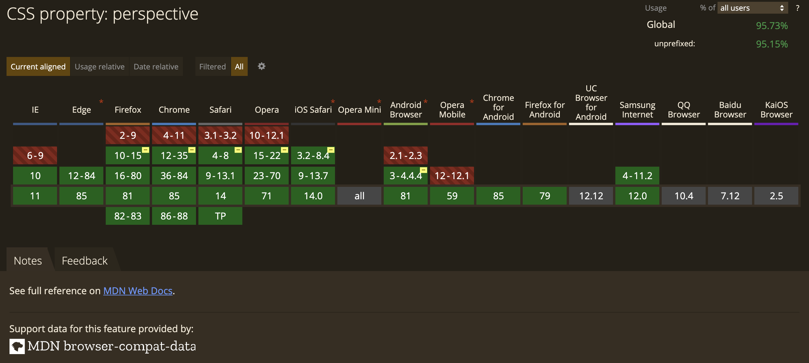
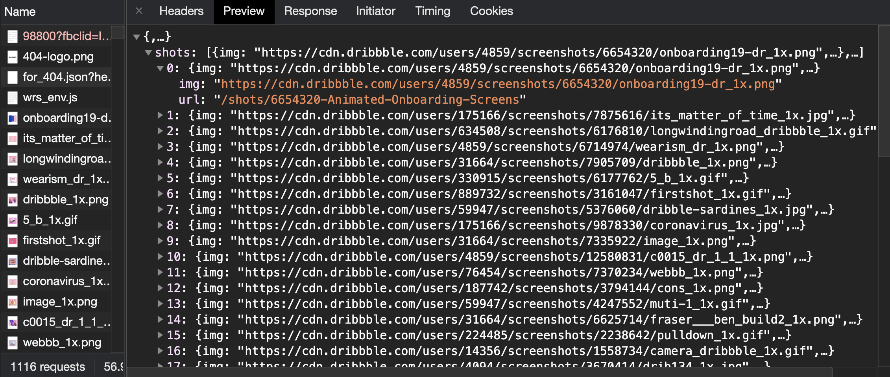
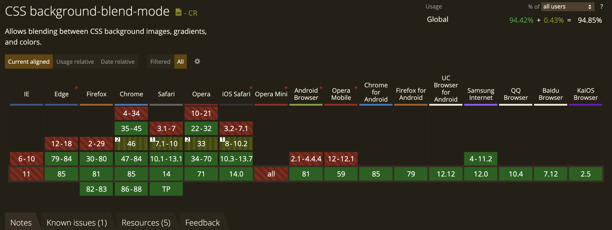

# dribbble 404 images in typescript

Study how [dribbble-404 page](https://dribbble.com/shots/902435-Website-Analytics-Dashboard/attachments/98800?fbclid=IwAR38Oqp0kxBYHKR8iamYRKFlkFpEzO-NMSfQ55RF30WnCvJqjvjXMwQ_3lE) make the beautiful 404 site and remake it.

[Demo](https://timingjl.github.io/dribbble-404-images-typescript/)


## Highlight

- using CRA template `typescript`.
- using `useMemo` to reduce useless re-render.
- using `background-blend-mode` to change image color.
- override `<input type="range" />` css style for color picker slider bar.

## 畫面排版

### 區塊規劃

畫面中沒有特別複雜的切版，由上到下分為三大塊，分別為 nav, main, footer；

其中我們希望 nav 及 footer 為固定高度，main 為依照螢幕大小填滿剩餘的空間。

由於現代瀏覽器對於 css flex 屬性支援還不錯，因此類似的情境我喜歡用 flex 來處理。

- 首先將外容器用 `display: flex;` 宣告為 flex 容器，由於 `display: flex;` 預設為水瓶排版，因此我們用 `flex-direction: column;` 讓他變成垂直排版
- 接著在 main 的區塊設定為 `flex: 1 1 auto;` ，使他可以填滿剩餘空間。


### 左右適應螢幕寬度

我們希望中間主要的 `404` 文字大小由螢幕的寬度來決定。並且，我們不排除未來有可能可以支援三個字元以上，例如說 `9487` 或是 `1314520` 之類的，但由於寬度有限，字元越多的話，勢必需要讓字體也變小才放得下。因此我們希望 font-size 跟寬度成正比，跟字元多寡成反比。

```scss
font-size: ${props => 90 / props.size}vw;
```

> vw 表示的是 view width，也就是螢幕可是範圍寬度的百分比。

[src/containers/MainContent/Collage/index.tsx](https://github.com/TimingJL/dribbble-404-images-typescript/blob/master/src/containers/MainContent/Collage/index.tsx#L12)

## 飛入圖片動畫

### 如何用圖片像拼圖那樣排列成404的樣子

- 純手工，先用文字在下面的圖層當成底圖，再一張一張調整位置拼上去的😅
- 以左上角為原點，紀錄每張圖片的相對位置 X & Y，因此放大縮小不會破版。
- 一個數字或字元只要紀錄一次，未來即可重複使用。
- 目前只有實現 `0` 和 `4` ，之後可以繼續擴增。

```js
const imagePositions = {
  0: [
    [42, 20.5],
    [42, 74],
    [22.5, 22.5],
    ...
    ...
  ],
  4: [
    [42.5, 27.5],
    [34, 34],
    [24, 40],
    ...
    ...
  ],
};
```
[src/containers/MainPage/Collage/Character/CollageImages/constants.js](https://github.com/TimingJL/dribbble-404-images-typescript/blob/master/src/containers/MainPage/Collage/Character/CollageImages/constants.js#L1)

**是否有更聰明的方法？**

- 做一個小工具幫我們取得位置
  - 小工具可以幫助我們在畫面上點擊，點到的位置會 show 出圖片並顯示相對位置。
  - 點擊之後，可以用拖拉的方式微調圖片位置。
  - 排版完畢之後，直接把位置複製貼上到上面的 `imagePositions` 結構當中。

### 如何讓圖片飛入

- CSS 屬性 perspective 指定了觀察者與 z=0 平面的距離，使具有三維位置變換的元素產生透視效果，如果沒有設定透視(perspective)，transform 3D 就會像平面一樣呈現。
  - 設定 camera：`perspective`(物體到攝影機的距離)， `perspective-origin`(攝影機的中心點位置)
  - 設定 space：`transform-style`，預設為 flat，因此要設定為 `preserve-3d`。
  - 設定 box：讓 Z 的深度有所變化 `translateZ` or `rotate`。
- 另外由於飛入的時候，想要製造圖片由近而遠往前飛的效果，物理上，近距離的東西看起來比較大，變遠之後東西看起來會比較小，所以這邊加入 transform 的 `scale` 屬性來調整圖片方大縮小的比例。

```html
<div class="camera">
    <div class="space">
        <div class="box"></div>
    </div>
</div>
```

```javascript
const transformAnimation = () => {
  const z = 1000 * Math.random();
  return keyframes`
    0% {
      opacity: 0;
      transform: translateZ(${z}px) scale(2);
    }
    100% {
      opacity: 1;
      transform: translateZ(0px);
    }
  `;
};
```



[玩轉 CSS 3D - 原理篇](https://www.oxxostudio.tw/articles/201506/css-3d.html)

### 圖片載入處理

```js
fetchAndBuildShots: function(){
  var that = this
  var hex = this.syncColors()

  this.loading()
  this.colorRange.disabled = true

  // call api and get new shots
  var request = new XMLHttpRequest()
  // https://dribbble.com/colors/for_404.json?hex=ff00d4
  request.open('GET', '/colors/for_404.json?hex=' + hex.replace('#',''), true)
  request.setRequestHeader("X-Requested-With", "XMLHttpRequest")
  request.onload = (function() {
    if (request.status == 200) {
      this.colorRange.disabled = false
      this.shots = JSON.parse(request.response).shots
      if( this.shots.length > 0 ){
        this.loaded()
      }
      this.build404Shots(this.shots)
    } else {
      console.log("Error fetching colors.")
    }
  }).bind(this);
  request.onerror = function() {
    console.log("Error fetching colors.")
  };
  request.send()
}
```

**Referrer Policy: strict-origin-when-cross-origin**


```js
build404Shots: function(data){
  this.collageImages.innerHTML = ''
  var numLoaded = 0
  var that = this

  //create all links to shots and images
  Array.prototype.forEach.call(data,function(shot,i){

    if(i>51) return;

    var link = document.createElement("a")
    link.href = shot.url

    //randomly position and style each shot link
    var x = 0*Math.random()
    var y = 0*Math.random()
    var z = 500*Math.random()
    var s = (0.75 + 0.25*Math.random())
    var transform = "translateX(" + x + "%) translateY(" + y + "%) scale(" + s + ") "
    link.style.transform = transform + " translateZ(" + z + "px)"
    link.style.color = "rgba(0,0,0," + (1-s)*0.5 + ")"
    link.style.boxShadow = "0 0 0 currentColor"

    //setup the shot image
    var img = document.createElement("img")

    function imgLoaded(){
      numLoaded++;
      link.classList.add("loaded")
      link.style.transform = transform
      setTimeout(function(){
        link.classList.add("introduced")
      },2000)
      if(numLoaded == data.length){
        that.loaded()
      }
    }

    //start loading the image
    img.src = shot.img;
    if(img.complete){
      setTimeout(imgLoaded,10)
    }else{
      img.addEventListener("load",imgLoaded)
      img.addEventListener("error",imgLoaded)
    }

    // append all to the 404 images
    link.appendChild(img)
    that.collageImages.appendChild(link)

  });
},
```

### 圖片顏色處理

由於 dribbble shot api 有 `strict-origin-when-cross-origin`，因此我們沒辦法使用它。因此下面有幾種可以拿到圖片的方式：

1. 自己做爬蟲去 dribbble 上面爬圖片，並且架一個 shot api server
    - 優點：可以做到幾乎跟原作一樣的效果
    - 缺點：開發及維護成本高
2. 使用有透明度的顏色遮罩蓋在圖片上面
    - 優點：不用寫爬蟲、api server
    - 缺點：所選擇的顏色總是會差一個透明度，所以看起來顏色比較淡，視覺效果沒有那麼好。如果調高透明度，那麼後面圖片就會看不清楚，但若調低透明度，則我們所指定的顏色就會不那麼明顯。
3. 使用 CSS property: `background-blend-mode`，使用 `multiply` 模式，可以幫助我們把 2 張圖像用混合模式做效果。
    - 優點：不用寫爬蟲、api server、不會有透明度問題
    - 缺點：會失去原本圖片的顏色，但這個缺點我覺得比上面的遮罩變色方式較為能夠被接受。

```css
background-image: url(imageUrl), linear-gradient(#f00, #f00);
background-blend-mode: multiply;
```



[使用 background-blend-mode 实现主色改为渐变色](https://www.cnblogs.com/coco1s/p/8080211.html)
[不可思议的混合模式 background-blend-mode](https://github.com/chokcoco/iCSS/issues/31)

## 彩色顏色選擇拉霸(Color Picker Slider Bar)

### 拉霸

實現方式

1. 使用 RxJS 來實作拖拉功能
2. 直接覆寫 `<input type="range" />` 的 CSS 樣式

**使用 RxJS 來實作拖拉功能**

1. 首先畫面上有一個元件(thumbDOM)
2. 當滑鼠在元件(thumbDOM)上按下左鍵(mousedown)時，開始監聽滑鼠移動(mousemove)的位置
3. 當滑鼠左鍵放掉(mouseup)時，結束監聽滑鼠移動
4. 當滑鼠移動(mousemove)被監聽時，跟著修改元件的樣式屬性

```js
const mouseDown = fromEvent(thumbDOM, 'mousedown');
const mouseUp = fromEvent(body, 'mouseup');
const mouseMove = fromEvent(body, 'mousemove');
mouseDown
  .pipe(
    concatMap(() => mouseMove.pipe(takeUntil(mouseUp))),
    map((moveEvent) => moveEvent.clientX),
  )
  .subscribe((mousePosX) => {
    handleSetValue(trackDOM, mousePosX);
  });
```

[src/components/ColorPickerSlider/customHooks.js](https://github.com/TimingJL/dribbble-like-collage-images-animation/blob/master/src/components/ColorPickerSlider/customHooks.js#L15)

**直接覆寫 `<input type="range" />` 的 CSS 樣式**
使用到-webkit-appearance這個特殊屬性，這是 webkit 特有的屬性，代表使用系統預設的外觀。

只要我們將這個屬性設為 none，那麼原本 range 的樣式就不會呈現了，這時我們只要加入自己的背景、陰影...等樣式。

```css
input[type="range"]{
  -webkit-appearance: none;
  /* 覆寫 thumb 的樣式 */
  background: linear-gradient(
    to right,
    ${COLOR_RED},
    ${COLOR_YELLOW},
    ${COLOR_GREEN},
    ${COLOR_BLUE_LIGHT},
    ${COLOR_BLUE_DARK},
    ${COLOR_PURPLE},
    ${COLOR_RED}
  );
}

input[type="range"]::-webkit-slider-thumb{
  -webkit-appearance: none;
  /* 覆寫 slider 的樣式 */
}
```

[src/containers/MainContent/Explore/index.tsx](https://github.com/TimingJL/dribbble-404-images-typescript/blob/master/src/containers/MainContent/Explore/index.tsx#L21)

### 拖拉功能選顏色

因為我們拉霸有`六種`顏色，分別是`紅色、黃色、綠色、淺藍、深藍、紫色、回到紅色`。兩個相鄰的顏色彼此漸層。所以這邊我就用兩個顏色相鄰的距離，來對應相對的顏色。

由於顏色的表達是由16進位的 00 到 ff ，或是 ff 到 00 ，因此把距離換算成相對應比例的 16 進位數字 之後，就能夠產生相對應的色票顏色了。

```js
const COLOR_RED = '#f00';
const COLOR_YELLOW = '#ff0';
const COLOR_GREEN = '#0f0';
const COLOR_BLUE_LIGHT = '#0ff';
const COLOR_BLUE_DARK = '#00f';
const COLOR_PURPLE = '#f0f';
```

[src/containers/MainContent/Explore/utils.tsx /
](https://github.com/TimingJL/dribbble-404-images-typescript/blob/master/src/containers/MainContent/Explore/utils.tsx#L3)

## 問題與討論

### Styled-components

**優點：**

- 是一個 CSS in JS 的函式庫，可以用 JavaScript 來定義 classNames 及 styles。提供我們能撰寫變量、循環、函數等，使我們更隨心所欲地做出複雜的樣式。
- 幫助我們將樣式寫成語意化的元件。支援 React 的 props 傳入，操作起來接近 React component。
- 每次 props 發生改變，會為我們產生一個 hash 命名的 className，幫助我們輕易解決 CSS 作用域痊癒衝突的問題。
- 提供 ThemeProvider 可以簡單抽換全域所需要使用的主題樣式。
- 跟其他 JSS ，例如 Material UI `@material-ui/styles` 提供的 `makeStyles`比起來，語法與原生 CSS 接近，因此可以無痛轉移。

一般來說，CSS的限制是他沒有變量、循環和函數等邏輯，所以我們很難在撰寫純 CSS 的時候做出複雜的變化，為了解決這個問題，開始出現了在JS上編寫CSS的做法， styled-components 是其中一種解決方案。

使用 styled-components 的好處有很多，例如它可以幫助我們將樣式寫成更具`語義化的組件`的形式，提高可讀性。另外有一個我很喜歡的功能，就是可以`將 React 的參數用 props 的方式傳入`來控制樣式。

因為 CSS 的作用域是全局的，所以很容易產生衝突，特別是在專案更複雜的時候。但是使用styled-components 會為我們生成的 React 元件產生隨機的 className，重複使用這些元件的時候隨機的 className 也會不同，因此能夠避免元件之間 className 的衝突，順利的解決CSS全局作用域的問題。

**缺點：**

- 由於是 hash 產生的 className，因此打開 `browser devtool` 會容易找不到想要找的元件。
  - 解法01: 在每個 styled-components 元件下面，可以定義自己的 className
  - 解法02: 使用 `styled-components/macro`
- 只要每次傳入的 props 發生改變，styled-components 元件就需要產一個新的 class 來改變樣式。因此，太頻繁更新的元件，會造成 render 速度變慢的效能問題。
  - 解法01：想辦法減少不必要的 re-render (React.memo, useMemo)
  - 解法02：使用 inline-style (style object) 來代替 `styled-components`
  - 解法03：不要用 styled-components..... 😭


```js
const StyledElement = styled(Element)`
  width: 80%;
  height: 300px;
  box-shadow: 0 0 5px 2px #ccc;
  .element__img {
    display: inline-block;
    width: 300px;
    height: 100%;
    background-image: url('this is background url');
  }
  .element__info {
    display: inline-block;
    vertical-align: top;
    width: calc(100% - 300px);
    height: 100%;
    text-align: left;
    .element__title {
      padding: 20px 0 0 20px;
      font-size: 48px;
      color: ${props => (props.red ? 'red' : 'black')};
    }
    .element__description {
      padding: 20px;
      font-size: 30px;
      font-style: italic;
      color: #888888;
    }
  }
`
```

> "Over 200 classes were generated for component styled.div. Consider using the attrs method, together with a style object for frequently changed styles."

## References

[cra-template-typescript](https://github.com/facebook/create-react-app/tree/master/packages/cra-template-typescript)
