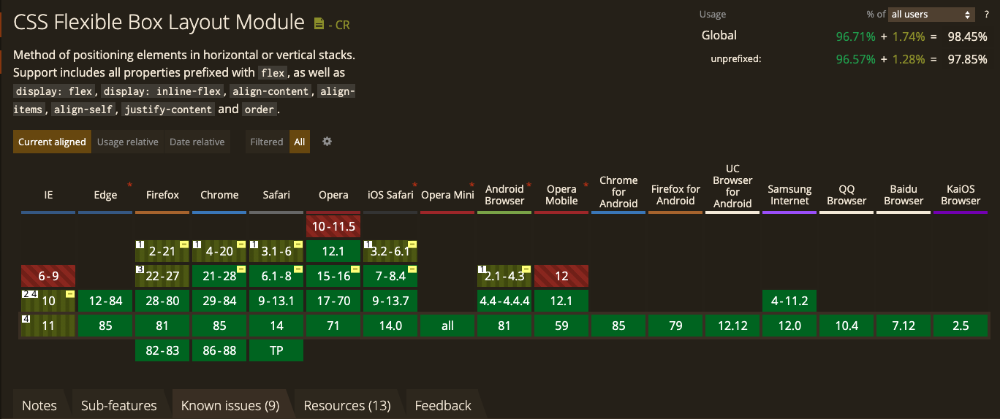

# dribbble 404 images in typescript

Study how [dribbble-404 page](https://dribbble.com/shots/902435-Website-Analytics-Dashboard/attachments/98800?fbclid=IwAR38Oqp0kxBYHKR8iamYRKFlkFpEzO-NMSfQ55RF30WnCvJqjvjXMwQ_3lE) make the beautiful 404 site and remake it.

[Demo](https://timingjl.github.io/dribbble-404-images-typescript/)


## Highlight

- using CRA template `typescript`.
- using `useMemo` to reduce useless re-render.
- using `background-blend-mode` to change image color.
- override `<input type="range" />` css style for color picker slider bar.

## 畫面排版

### 區塊規劃

畫面中沒有特別複雜的切版，由上到下分為三大塊，分別為 nav, main, footer；

其中我們希望 nav 及 footer 為固定高度，main 為依照螢幕大小填滿剩餘的空間。

由於現代瀏覽器對於 css flex 屬性支援還不錯，因此類似的情境我喜歡用 flex 來處理。

- 首先將外容器用 `display: flex;` 宣告為 flex 容器，由於 `display: flex;` 預設為水瓶排版，因此我們用 `flex-direction: column;` 讓他變成垂直排版
- 接著在 main 的區塊設定為 `flex: 1 1 auto;` ，使他可以填滿剩餘空間。



### 左右適應螢幕寬度

我們希望中間主要的 `404` 文字大小由螢幕的寬度來決定。並且，我們不排除未來有可能可以支援三個字元以上，例如說 `9487` 或是 `1314520` 之類的，但由於寬度有限，字元越多的話，勢必需要讓字體也變小才放得下。因此我們希望 font-size 跟寬度成正比，跟字元多寡成反比。

```scss
font-size: ${props => 90 / props.size}vw;
```

[src/containers/MainContent/Collage/index.tsx](https://github.com/TimingJL/dribbble-404-images-typescript/blob/master/src/containers/MainContent/Collage/index.tsx#L12)

## 飛入圖片動畫

### 如何用圖片像拼圖那樣排列成404的樣子

- 純手工，先用文字在下面的圖層當成底圖，再一張一張調整位置拼上去的😅
- 以左上角為原點，紀錄每張圖片的相對位置 X & Y，因此放大縮小不會破版。
- 一個數字或字元只要紀錄一次，未來即可重複使用。
- 目前只有實現 `0` 和 `4` ，之後可以繼續擴增。

```js
const imagePositions = {
  0: [
    [42, 20.5],
    [42, 74],
    [22.5, 22.5],
    ...
    ...
  ],
  4: [
    [42.5, 27.5],
    [34, 34],
    [24, 40],
    ...
    ...
  ],
};
```

**是否有更聰明的方法？**

- 做一個小工具幫我們取得位置
  - 小工具可以幫助我們在畫面上點擊，點到的位置會 show 出圖片並顯示相對位置。
  - 點擊之後，可以用拖拉的方式微調圖片位置。
  - 排版完畢之後，直接把位置複製貼上到上面的 `imagePositions` 結構當中。

### 如何讓圖片飛入

[src/containers/MainPage/Collage/Character/CollageImages/constants.js](https://github.com/TimingJL/dribbble-404-images-typescript/blob/master/src/containers/MainPage/Collage/Character/CollageImages/constants.js#L1)

## References

[cra-template-typescript](https://github.com/facebook/create-react-app/tree/master/packages/cra-template-typescript)
